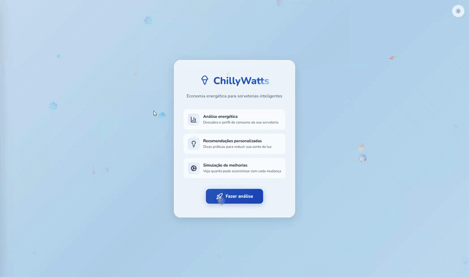

<div align="center">

# ⚡🍦 ChillyWatts

### Economia energética para sorveterias inteligentes


**🟢 [Projeto rodando em produção](http://163.176.254.79/)**

</div>

---

## 📋 Sumário

- [Sobre o Projeto](#-sobre-o-projeto)
- [Demo](#-demo)
- [Funcionalidades](#-funcionalidades)
- [Arquitetura](#-arquitetura)
- [Tecnologias](#-tecnologias)
- [Como Rodar](#-como-rodar)
- [Estrutura do Projeto](#-estrutura-do-projeto)
- [API Endpoints](#-api-endpoints)
- [Machine Learning](#-machine-learning)
- [Modelo de Dados](#-modelo-de-dados)
- [Integrantes](#-integrantes)

---

## 🎯 Sobre o Projeto

O **ChillyWatts** é uma plataforma de análise energética desenvolvida para resolver a falta de visibilidade sobre o desperdício elétrico em **sorveterias** — estabelecimentos com operações intensivas de refrigeração que consomem grande parte da energia no sistema de congelação e exposição de sorvetes.

A aplicação combina **Data Science** e infraestrutura na **Oracle Cloud (OCI)** para cruzar dados operacionais (como inventário de freezers, sazonalidade e consumo em horários de pico), calculando o consumo teórico esperado e diagnosticando o perfil energético da sorveteria.

### 🏆 Destaques

- 📊 **Classificação da eficiência energética** via API REST (Eficiente / Moderado / Ineficiente)
- 💰 **Cálculo de impacto financeiro** baseado na tarifa de referência (R$ 0,75/kWh)
- 💡 **Recomendações práticas** com estimativa de redução de até **20% nos custos operacionais**
- 🤖 **Modelo de Machine Learning** (Random Forest) que classifica o perfil energético e calcula a **probabilidade** de cada categoria, com fallback em Java
- 📱 **Interface responsiva** com dark mode e animações

---

## 🎬 Demo

### 📸 Screenshots

<div align="center">

**Landing Page**



---

**Cadastro de CNPJ**


---

**Formulário de Análise**


---

**Resultado da Análise**


---

**Simulação de Melhorias**


---

**Dark Mode**


---

**Histórico via Chatbot**


</div>

---

## ✨ Funcionalidades

### 🔍 Análise Energética

- Recebe dados de consumo mensal (kWh), horários de pico, inventário de freezers e perfil de uso
- Calcula o **consumo teórico** baseado nas especificações dos equipamentos
- Classifica o perfil em **Eficiente**, **Moderado** ou **Ineficiente**
- Gera **recomendações personalizadas** para redução de desperdício

### ❄️ Inventário de Freezers

- Cadastro e gestão de equipamentos por CNPJ
- Cálculo automático de consumo por freezer (potência × horas × fatores)
- Suporte a diferentes tecnologias (Convencional / Inverter)
- Verificação do estado das borrachas de vedação

### 💡 Recomendações Personalizadas

- Dicas baseadas no perfil de eficiência
- Sugestões de manutenção (borrachas, limpeza)
- Recomendações sazonais (verão vs inverno)
- Conselhos sobre horários de pico
- Estimativa de economia financeira

### 📊 Simulação de Melhorias

- Simulador interativo com melhorias quantificadas
- Impacto percentual por melhoria
- Recálculo em tempo real do custo mensal estimado
- Estimativa de economia potencial

### 🤖 Chatbot Assistente

- Interface conversacional para coleta de dados
- Histórico de análises por CNPJ
- Validação de CNPJ em tempo real

### 🌙 Dark Mode

- Tema claro e escuro com transição suave
- Preferência salva no navegador

---

## 🏗️ Arquitetura

|       Camada       |  Tecnologia  | Porta | Descrição                    |
| :----------------: | :----------: | :---: | :--------------------------- |
|    **Frontend**    |    Nginx     |  :80  | Interface SPA (HTML/CSS/JS)  |
|    **Backend**     | Spring Boot  | :8080 | API REST + lógica de negócio |
|   **ML Service**   | Python Flask | :5000 | Modelo de Machine Learning   |
| **Banco de Dados** |  MySQL 8.4   | :3306 | Persistência de dados        |

**Fluxo:** Frontend → Backend → ML Service → MySQL

### Fluxo de Análise

```
1. Usuário envia dados (consumo, inventário, perfil)
         │
         ▼
2. Backend calcula consumo teórico
   (potência × 24h × 30d × quantidade × fatores)
         │
         ▼
3. Backend classifica via ML (Python)
   └─ Fallback: classificação em Java (regras)
         │
         ▼
4. Gera recomendações personalizadas
         │
         ▼
5. Calcula impacto financeiro (R$ 0,75/kWh)
         │
         ▼
6. Persiste no MySQL e retorna JSON
```

---

## 🛠️ Tecnologias

### Frontend

|                                           Tecnologia                                           | Uso                         |
| :--------------------------------------------------------------------------------------------: | :-------------------------- |
|            | Estrutura da página         |
|              | Estilização e design system |
|  | Lógica da aplicação         |
|            | Servidor web                |

### Backend

|                                             Tecnologia                                              | Uso                 |
| :-------------------------------------------------------------------------------------------------: | :------------------ |
|             | Linguagem principal |
|  | Framework REST API  |
|      | Persistência        |
|             | Documentação da API |

### Machine Learning

|                                             Tecnologia                                             | Uso                    |
| :------------------------------------------------------------------------------------------------: | :--------------------- |
|         | Serviço ML             |
|            | API do modelo          |
|  | Random Forest          |
|              | Processamento de dados |
|            | Análise exploratória   |

### Infraestrutura

|                                              Tecnologia                                               | Uso              |
| :---------------------------------------------------------------------------------------------------: | :--------------- |
|                 | Containerização  |
|           | Hospedagem (OCI) |
|               | Banco de dados   |
|  | CI/CD            |

---

## 🚀 Como Rodar

### Pré-requisitos

- [Docker](https://docs.docker.com/get-docker/) e [Docker Compose](https://docs.docker.com/compose/install/)
- Git

### 1. Clone o repositório

```bash
git clone https://github.com/seu-usuario/hackaton_energiai_team03.git
cd hackaton_energiai_team03
```

### 2. Execute com Docker Compose

```bash
docker-compose up -d --build
```

### 3. Acesse a aplicação

|     Serviço     |                                      URL                                       |
| :-------------: | :----------------------------------------------------------------------------: |
|  **Frontend**   |                   [http://localhost:80](http://localhost:80)                   |
| **Backend API** |                 [http://localhost:8080](http://localhost:8080)                 |
| **Swagger UI**  | [http://localhost:8080/swagger-ui.html](http://localhost:8080/swagger-ui.html) |
| **ML Service**  |                 [http://localhost:5000](http://localhost:5000)                 |

> 🌐 **Em produção:** [http://163.176.254.79/](http://163.176.254.79/) (Oracle Cloud Infrastructure)

### 4. Verifique a saúde dos serviços

```bash
# Verificar todos os containers
docker-compose ps

# Verificar backend
curl http://localhost:8080/health

# Verificar ML service
curl http://localhost:5000/health
```

---

## 📁 Estrutura do Projeto

```
hackaton_energiai_team03/
├── 📂 assets/                    # Screenshots e GIFs para o README
│
├── 📂 frontend/                  # Frontend (HTML/CSS/JS puro)
│   ├── index.html                # SPA principal
│   ├── style.css                 # Design system completo (3300+ linhas)
│   ├── script.js                 # Lógica da aplicação (~1800 linhas)
│   └── Dockerfile                # nginx:alpine
│
├── 📂 chillywatts/               # Backend (Spring Boot)
│   ├── src/main/java/dev/team3/chillywatts/
│   │   ├── controller/           # REST Controllers
│   │   ├── service/              # Lógica de negócio
│   │   ├── entity/               # Entidades JPA
│   │   ├── dto/                  # Data Transfer Objects
│   │   ├── enums/                # Enumerações
│   │   └── repository/           # Repositórios JPA
│   ├── src/main/resources/
│   │   └── application.properties
│   ├── pom.xml                   # Dependências Maven
│   └── Dockerfile                # Multi-stage build
│
├── 📂 dataset/                   # Serviço ML (Python Flask)
│   ├── ml_service.py             # API do modelo
│   ├── modelo_ml.py              # Treinamento do Random Forest
│   ├── gerador_dados.py          # Gerador de dataset sintético
│   ├── motor_analise.py          # Motor de análise standalone
│   ├── modelo_chillywatts.pkl    # Modelo treinado
│   ├── dataset_energia_sorveteria.csv
│   ├── notebook_chillywatts.ipynb
│   ├── requirements.txt
│   └── Dockerfile                # python:3.12-slim
│
├── 📂 database/
│   └── schema.sql                # Schema do MySQL
│
├── 📂 .github/workflows/
│   └── deploy.yml                # CI/CD para OCI
│
└── docker-compose.yaml           # Orquestração dos 4 serviços
```

---

## 📡 API Endpoints

### Análise Energética

| Método  | Endpoint                                 | Descrição                           |
| :-----: | :--------------------------------------- | :---------------------------------- |
| `POST`  | `/analise-energetica`                    | Realiza análise energética completa |
|  `GET`  | `/api/analises/historico`                | Retorna histórico de análises       |
|  `GET`  | `/api/analises/historico/por-cnpj?cnpj=` | Histórico por CNPJ                  |
| `PATCH` | `/api/analises/{id}`                     | Atualiza nome/CNPJ de uma análise   |

### Inventário

| Método | Endpoint                | Descrição                   |
| :----: | :---------------------- | :-------------------------- |
| `GET`  | `/api/inventario?cnpj=` | Busca inventário por CNPJ   |
| `PUT`  | `/api/inventario`       | Cria ou atualiza inventário |

### Saúde

| Método | Endpoint       | Descrição            |
| :----: | :------------- | :------------------- |
| `GET`  | `/health`      | Status do backend    |
| `GET`  | `/health` (ML) | Status do serviço ML |

### Exemplo de Request

```json
POST /analise-energetica
Content-Type: application/json

{
  "nome": "Maria",
  "consumoKwh": 450,
  "usoHorarioPico": true,
  "intensidadeMovimento": "MEDIO",
  "epocaAno": "VERAO",
  "freezers": [
    {
      "marca": "Brastemp",
      "tipo": "EXIBICAO",
      "tecnologia": "CONVENCIONAL",
      "estadoBorracha": "INTEGRA",
      "quantidade": 2
    }
  ],
  "salvar": true,
  "cnpj": "12345678000190"
}
```

### Exemplo de Response

```json
{
  "perfilEnergetico": "MODERADO",
  "probabilidade": 0.72,
  "consumoTeoricoEstimadoKwh": 380.50,
  "custoMensalAtual": 337.50,
  "economiaEstimadaPotencial": 67.50,
  "recomendacoes": [
    "Considere trocar equipamentos convencionais por Inverter",
    "Evite abrir os freezers nos horários de pico (18h-21h)"
  ],
  "melhoriasSimulacao": [...]
}
```

---

## 🤖 Machine Learning

### Modelo

- **Algoritmo:** Random Forest Classifier (100 árvores)
- **Features:** 6 variáveis de entrada
  1. Estação do ano (label encoded)
  2. Nível de uso no pico (label encoded)
  3. Quantidade total de equipamentos
  4. Estado das borrachas de vedação (label encoded)
  5. Consumo teórico estimado (kWh)
  6. Consumo real informado (kWh)
- **Saída:** Classifica o perfil energético em **Eficiente**, **Moderado** ou **Ineficiente**, calculando a **probabilidade** de cada classe (0 a 1). O modelo retorna a categoria com maior confiança e sua respectiva probabilidade, permitindo avaliar o quão eficiente é o consumo da sorveteria.

### Treinamento

```bash
cd dataset
python modelo_ml.py
```

### Dataset

O dataset sintético foi gerado com **1000 registros** contendo:

- Padrões realistas de consumo para sorveterias
- Efeitos sazonais (verão = +20% consumo, inverno = -20%)
- Variação comportamental (ruído realista)
- Classificação balanceada entre as 3 categorias

### Fallback em Java

Caso o serviço ML esteja indisponível, o backend utiliza um sistema de **pontuação de ineficiência** em Java que avalia:

- Uso em horário de pico
- Horas de alto consumo
- Proporção consumo real vs teórico
- Quantidade de equipamentos

### Testes com os 3 Perfis

O projeto inclui **testes automatizados** que validam a classificação para os 3 cenários obrigatórios:

|       Perfil       | Consumo (kWh) |  Tecnologia  | Borracha | Pico | Resultado Esperado |
| :----------------: | :-----------: | :----------: | :------: | :--: | :----------------: |
|  ✅ **Eficiente**  |      180      |   Inverter   | Íntegra  | Não  |     Eficiente      |
|  ⚠️ **Moderado**   |      450      |    Misto     |    —     | Sim  |      Moderado      |
| ❌ **Ineficiente** |     1200      | Convencional |  Gasta   | Sim  |    Ineficiente     |

Os testes também validam **cenários sazonais** (verão e inverno), verificando se as recomendações e os fatores de consumo são aplicados corretamente.

---

## 🗄️ Modelo de Dados

### Tabela `analise_historico`

| Coluna                      |     Tipo     | Descrição                      |
| :-------------------------- | :----------: | :----------------------------- |
| `id`                        |   INT (PK)   | Identificador único            |
| `cnpj`                      | VARCHAR(14)  | CNPJ da empresa                |
| `nome`                      | VARCHAR(75)  | Nome do responsável            |
| `consumoRealKwh`            | DECIMAL(6,2) | Consumo informado (kWh)        |
| `usoHorarioPico`            | VARCHAR(50)  | Uso em horário de pico         |
| `epocaAno`                  |     ENUM     | Estação do ano                 |
| `perfilEnergetico`          |     ENUM     | Eficiente/Moderado/Ineficiente |
| `probabilidade`             | DECIMAL(5,2) | Probabilidade (0-100)          |
| `consumoTeoricoEstimadoKwh` | DECIMAL(6,2) | Consumo teórico calculado      |
| `custoMensalAtual`          | DECIMAL(8,2) | Custo mensal (R$)              |
| `economiaEstimadaPotencial` | DECIMAL(8,2) | Economia potencial (R$)        |

### Tabela `inventario`

| Coluna         |         Tipo         | Descrição              |
| :------------- | :------------------: | :--------------------- |
| `id`           |       INT (PK)       | Identificador único    |
| `cnpj`         | VARCHAR(14) (UNIQUE) | CNPJ da empresa        |
| `frezzersJson` |         JSON         | Inventário de freezers |
| `atualizadoEm` |       DATETIME       | Última atualização     |

---

## 💰 Cálculo de Consumo Teórico

```
Consumo = Potência × 24h × 30d × Quantidade × Fator Borracha × Fator Sazonal
```

| Parâmetro                   | Valor                                      |
| :-------------------------- | :----------------------------------------- |
| **Potência (Convencional)** | Exibição: 0.25 kW / Armazenamento: 0.15 kW |
| **Potência (Inverter)**     | Exibição: 0.18 kW / Armazenamento: 0.10 kW |
| **Fator Borracha (Gasta)**  | +25% de consumo                            |
| **Fator Sazonal (Verão)**   | ×1.20                                      |
| **Fator Sazonal (Inverno)** | ×0.80                                      |
| **Tarifa de referência**    | R$ 0,75 / kWh                              |

---

## 👥 Integrantes

<table>
  <tr>
    <td align="center">
      <a href="https://github.com/sybzinha">
        
        <br />
        <sub><b>Sybilla Coppi</b></sub>
      </a>
      <br />
      <sub>Líder & FullStack</sub>
      <br />
      <a href="https://www.linkedin.com/in/sybilla-coppi/">LinkedIn</a> • 
      <a href="https://github.com/sybzinha">GitHub</a> • 
      <a href="https://sybillacoppi.dev/">Portfólio</a>
    </td>
    <td align="center">
      <a href="https://github.com/LarisSanto">
        
        <br />
        <sub><b>Larissa dos Santos</b></sub>
      </a>
      <br />
      <sub>Data Science</sub>
      <br />
      <a href="https://www.linkedin.com/in/laris-santos">LinkedIn</a> • 
      <a href="https://github.com/LarisSanto">GitHub</a>
    </td>
    <td align="center">
      <a href="https://github.com/Tiago-Lindner">
        
        <br />
        <sub><b>Tiago Flores Lindner</b></sub>
      </a>
      <br />
      <sub>Backend</sub>
      <br />
      <a href="https://www.linkedin.com/in/tiago-flores-lindner/">LinkedIn</a> • 
      <a href="https://github.com/Tiago-Lindner">GitHub</a>
    </td>
    <td align="center">
      <a href="https://github.com/douglasn5">
        
        <br />
        <sub><b>Douglas Israel</b></sub>
      </a>
      <br />
      <sub>UX/UI Designer</sub>
      <br />
      <a href="https://www.linkedin.com/in/douglas-israel-3aaab6294">LinkedIn</a> • 
      <a href="https://github.com/douglasn5">GitHub</a>
    </td>
    <td align="center">
      <a href="https://github.com/leoo-tech">
        
        <br />
        <sub><b>Leonardo Costa</b></sub>
      </a>
      <br />
      <sub>DevOps</sub>
      <br />
      <a href="https://www.linkedin.com/in/leocosta26/">LinkedIn</a> • 
      <a href="https://github.com/leoo-tech">GitHub</a>
    </td>
    <td align="center">
      <a href="https://github.com/Lucas-matrixx">
        
        <br />
        <sub><b>Lucas Rodrigues Pinho</b></sub>
      </a>
      <br />
      <sub>Data Analyst</sub>
      <br />
      <a href="https://www.linkedin.com/in/lucasrods/">LinkedIn</a> • 
      <a href="https://github.com/Lucas-matrixx">GitHub</a>
    </td>
  </tr>
</table>

---

## 📄 Licença

Este projeto foi desenvolvido para o **Hackathon One G9 / Alura + Oracle**.

---

<div align="center">

Feito com 💙 pela equipe **ChillyWatts**

</div>
